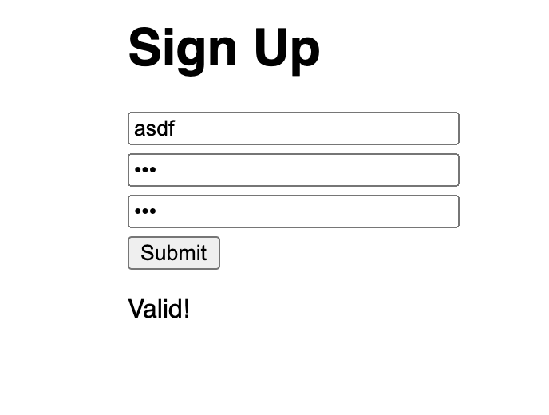

# React Password Validator

Recreate a password validator in React. Your final product should function similarly to [this deployed version](http://excellent-tail.surge.sh) of the component.



## Getting Started

- Fork and clone this repo
- Once you have the app locally, install necessary dependencies with `$ npm install`
- Start the development server locally with `$ npm start`, then visit `localhost:3000` in the browser to view app

## Instructions

Take the existing markup rendered from the `Validator` component in `src/Validator.js` and change into a fully functioning component. This means that you only have to add functionality -- not markup or styling -- to the existing code!

For this exercise, don't be concerned about the distinction between container and presentational components.

## Steps

1. Add your form inputs in `Validator.js`. Include inputs for `email`, `password`, `passwordConfirm`, and a `submit` button.
2. Add a constructor method and initialize state. Your state should include `email`, `password`, `passwordConfirm`, and `valid` properties.

```jsx
    this.state = {
      email: '',
      password: '',
      passwordConfirm: '',
      valid: true
    }
```

3. Add methods for handling inputs for password and password confirm, and checking that the passwords match. Be sure to update state in these methods using `.setState`
4. Bind the methods in the constructor.
5. Display a message if the user's inputs are valid.

### Bonus

* Make sure validation message doesn't show up until the User presses submit.  
* Make sure passwords are at least 7 characters in length.
* Make sure passwords includes a number and a special character. (Check out [Regex](http://emailregex.com/))
* Validate the email to make sure it includes an `@` sign.
* Highlight the inputs where the errors occurred.  

### Double Mega Bonus

* Include inputs for a date of birth with at least one validator.
* Check out the [Luhn Algorithm](https://en.wikipedia.org/wiki/Luhn_algorithm) and try your hand in validating a credit card number.

## Resources

- [Forms in React](https://facebook.github.io/react/docs/forms.html)
- [Bonus: Email Regex](http://emailregex.com/)
